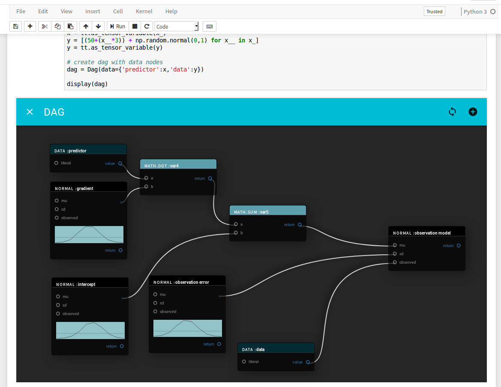

# FlowPyDag

Dataflow style GUI for defining probabilistic models in PyMC3.

v0.01 In Development

## Installing 
requires jupyter, npm & webpack
```
cd js; webpack; cd ..;sudo python setup.py develop;jupyter notebook
```

## Usage 
pre-alpha code in development!




Inside a Jupyter Notebook

```python
from flowpy import Dag
from IPython.display import display
data = 1,2,2,3,3,3,4,4,5,-10,10,-100,100

dag = Dag(data={'data':data})
display(dag)
```
Design a graph using the GUI, then hit 'compile code'. Compiling checks the graph for errors and draws quick
 approximate samples for the posteriors.

## #TODO
- Docs & Tests!
- Frontend ability to delete nodes
- Frontend ability to rename variables
- Required arguments
- Deterministic nodes!
- Add ability to save graphs
- Automate distribution extraction from PyMC3 to js frontend
- Sensible interface to Dag for use in later cells
- Axis labels on posterior histograms
- Pandas df as data node
- Identify node from Exceptions and pass to frontend
- pre-webpack everything & add setup script

