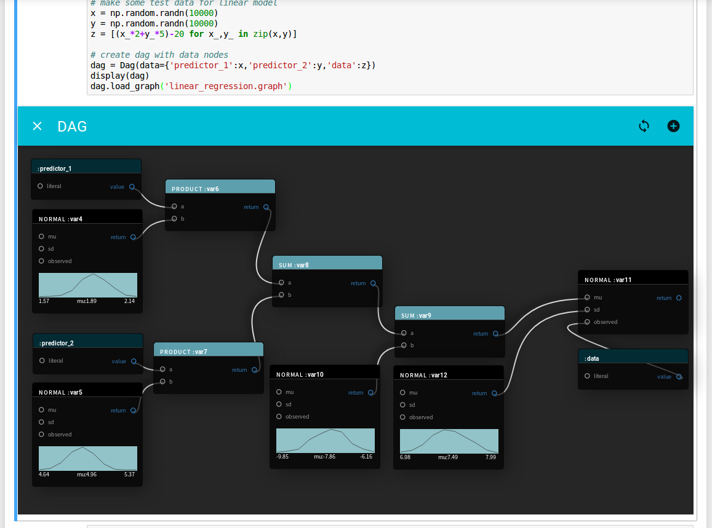

# FlowPyDag
v0.01 In Development(!)

FlowPyDag is an experiment in making a dataflow style GUI for defining probabilistic models in PyMC3 via 
a Jupyter notebook extension. The Jupyter plugin uses the reactJS framework, with a graph editor is based on [react-node-graph](https://www.npmjs.com/package/react-node-graph).




## Installing 
requires jupyter, npm & webpack
```
cd js; webpack; cd ..;sudo python setup.py develop;jupyter notebook
```

## Usage 

Inside a Jupyter Notebook

```python
from flowpy import Dag
from IPython.display import display
import numpy as np

# make some test data for linear model
x = np.random.randn(10000)
y = np.random.randn(10000)
z = [(x_*2+y_*5)-20 for x_,y_ in zip(x,y)]

# create dag with registered data nodes
dag = Dag(data={'predictor_1':x,'predictor_2':y,'data':z})

# display dag editor in notebook
display(dag)

# load example linear regression graph
dag.load_graph('linear_regression.graph')
```
Model data (and literals) must currently be specified when the dag is created (see #TODO). Nodes are added using the
 'add node' button, which provies a small set of distributions from PyMC3, and a few math nodes (more to come). Drag between 
 a nodes output and another nodes input to make a connection. Graphs must be acyclical to be valid.
 
 Hit the 'compile code' button to check that the model is valid and calculate approximate posteriors.
 
 Models can be saved or loaded after the dag has been displayed.
 ```python
display(dag)

# save graph
dag.save_graph('my_graph.graph')

# load graph
dag.load_graph('my_graph.graph')
```

 
## #TODO
- Docs & Tests!
- Full sampling options
- Frontend ability to delete nodes
- Frontend ability to rename variables
- Frontend ability to set input values to literals
- Required arguments
- Automate distribution extraction from PyMC3 to js frontend
- Sensible interface to Dag for use in later cells
- Pandas df as data node
- Identify node from Exceptions and pass to frontend
- pre-webpack everything & add setup script

